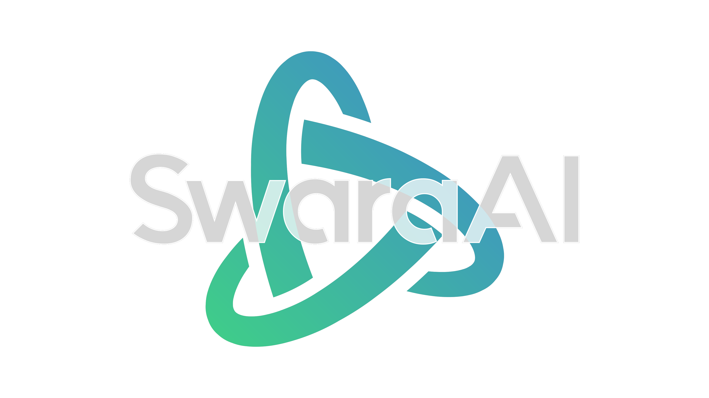

# SwaraAI - YouTube Video

[](https://www.youtube.com/watch?v=vvcQfcdNtH8)

YouTube video: [https://youtu.be/vvcQfcdNtH8](https://www.youtube.com/watch?v=vvcQfcdNtH8)

## Flow of the Presentation

To understand the flow of the presentation, please refer to [flow.md](flow.md).

## Installation

```bash
pip3 install -r requirements.txt
```

## Command to render the video

```bash
python3 main.py {SCENE} -r {RESOLUTION}
```

To render all the scenes, execute `python3 main.py all -r {RESOLUTION}`.

To render scenes in a specific folder, execute `python3 main.py all -f {FOLDER} -r {RESOLUTION}`.

## Help

For more information, execute `python3 main.py --help`.

### Quality of the Video

720p30 is the default resolution. To change the resolution, use the `-r` flag.

Flags for resolution:

- `-rl 480p15 (854x480)`
- `-rm 720p30 (1280x720)`
- `-rh 1080p60 (1920x1080)`
- `-rp 1440p60 (2560x1440)`
- `-rk 2160p60 (3840x2160)`

---

Created by [Gopal Saraf](https://gopalsaraf.com/).  
Created using [manim](https://www.manim.community/).
